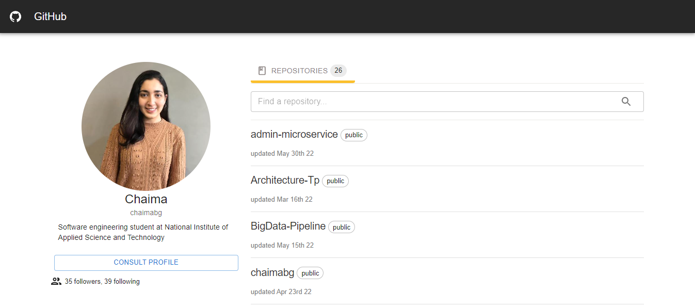

# React Application

## Purpose

Creating a responsive interface of a GitHub profile that follows good UX principles, using [React Typescript](https://reactjs.org/), [Material UI](https://mui.com/) and the [official GitHub API](https://docs.github.com/en/rest) to fetch repositories per user.\
This interface allows the user to filter through the repositories by name, consult the GitHub profile and open a repository. \
You can check the deployed application [here](https://github-repository-app.netlify.app/).

## Future Improvements

- Adding a pagination for repositories
- Improving the design
- Adding a filter for GitHub profiles by username
- Using the v4 API

## Interface

## Requirements
* [Node.js](https://nodejs.org/en/) version 14.20.0 or above

## Build project
```
$ git clone https://github.com/chaimabg/GitHub-Repositories.git
$ cd GitHub-Repositories
$ npm install
```
Before running the project you need to create a `.env` file In the project directory that contains this environment variables:

```
REACT_APP_GITHUB_TOKEN='your github token'
REACT_APP_GITHUB_USERNAME='any github username'
```


## Available Scripts

In the project directory, you can run:

### `npm start`

Runs the app in the development mode.\
Open [http://localhost:3000](http://localhost:3000) to view it in the browser.

The page will reload if you make edits.\
You will also see any lint errors in the console.

### `npm test`

Launches the test runner in the interactive watch mode.

